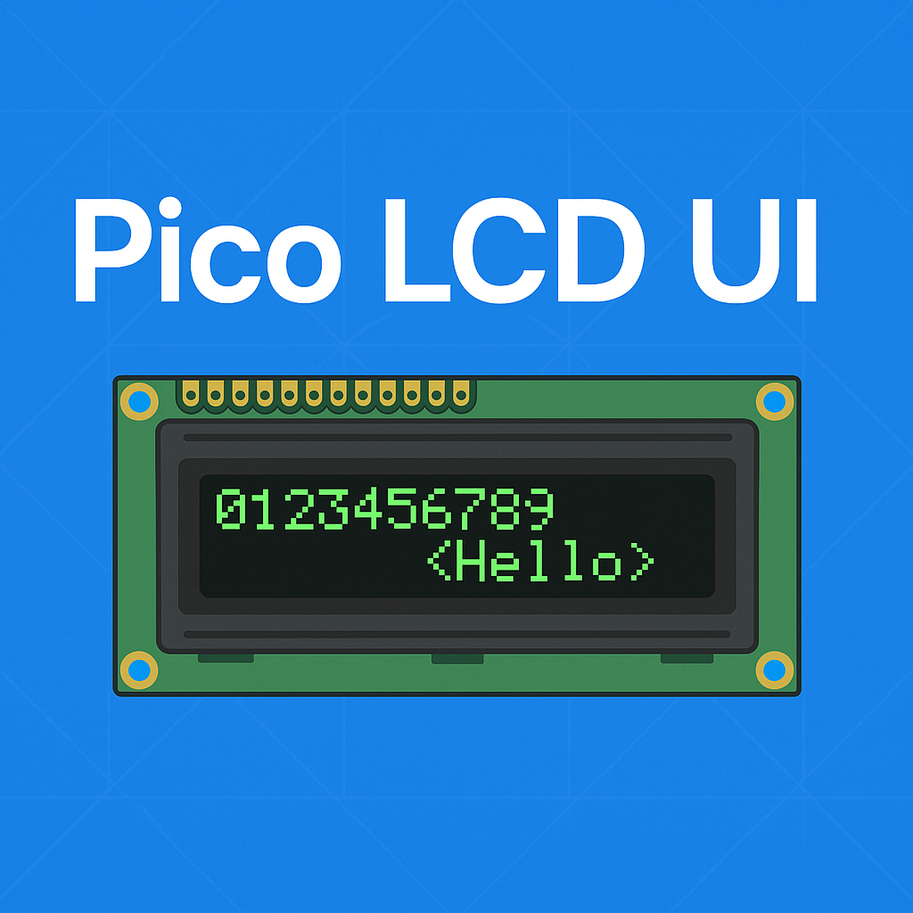
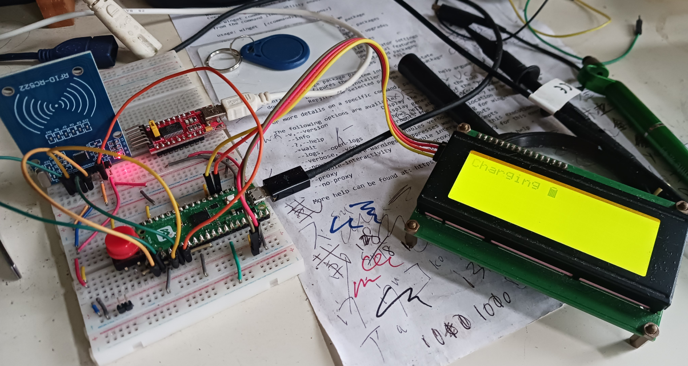

<!-- 封面圖 -->

<p align="center">
  
</p>

<p align="center">
  
  
</p>

<p align="center">
  
</p>

---

# Pico LCD1602 UI Module

🧩 A modular LCD control system for Raspberry Pi Pico, written in C/C++ with support for custom icons, semantic UI functions, and mixed-style API. The C++ library is copied from https://github.com/cristiancristea00/Pico-I2C-LCD. With the help of Copilot AI, I wrap it with C language and add UI interface.

---

## Features

- ✅ C-style fallback functions for pure-C usage
- 🌈 `lcd_icons.h` with custom 5x8 CGRAM symbols
- 🎛️ `lcd_ui.h` semantic API like `lcd_ui_show_status_bar()`
- 🧵 CMake modular structure (`lcd_module/`)

---

## Getting Started

```c
lcd_ui_init(0x27, 16, 2, i2c0, 4, 5);
lcd_ui_show_welcome();
```

---

## 📺 Demo

<p align="center">  </p>

---

 📁 Project Structure

```text
lcd1602/
├── main.c
├── CMakeLists.txt
├── lcd_module/
│   ├── lcd_wrapper.cpp / .h
│   ├── lcd_icons.h
│   ├── lcd_ui.h
│   ├── LCD_I2C.hpp / .cpp
│   └── CMakeLists.txt
├── assets/
│   ├── banner.png
│   └── lcd_demo.png
├── LICENSE
└── README.md
```

---

 🔏 License

This project is licensed under the MIT License — see the LICENSE file for details.

---

🤝 Contributing
Feel free to fork, submit issues, or open pull requests! Suggestions for icons, animations, or new UI components are welcome 🌟
